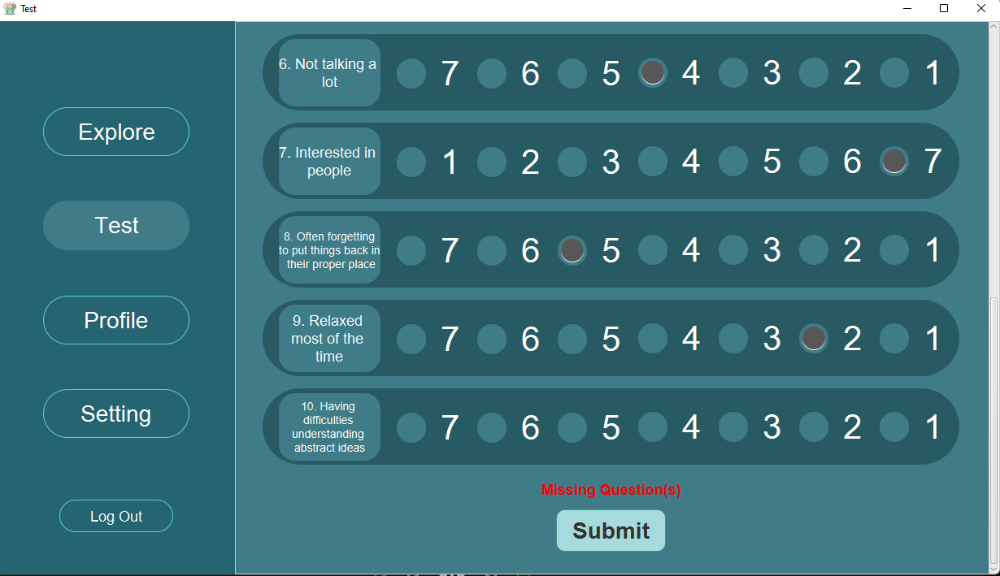
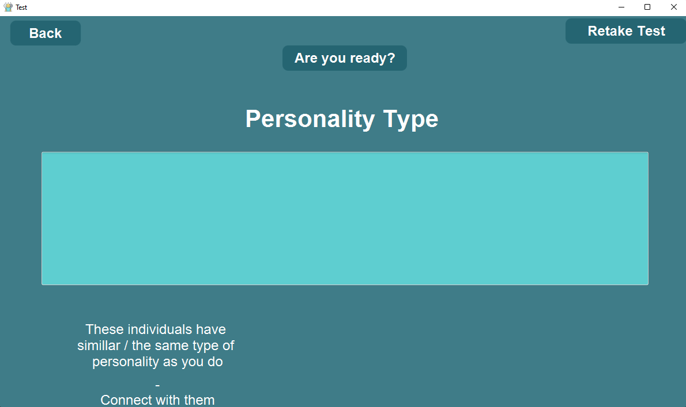

# Personality-Test

This is not a client-server model application.

Prerequisites :
  * Basic Understanding of File I/O
  * OOP Concept of Java
  * JavaFX
  * SceneBuilder

## Table of Contents  
1. [Overview](#overview) 
2. [Built Using](#built-using)
3. [Project Features ( Explore, Test, Profiles, Setting, Log out)](#project-features)
4. [Contributors](#contributors)
5. [Installation](#installation)
6. [References](#references)
7. [Link To Demo](https://www.youtube.com/watch?v=7C6ZGGCizWU)

## Overview 
The program will first show a [<i><b>login page</b></i>](#login-page) for existing users to access their data.
* The login section handles [invalid information*](#invalid-information) given by the users.
  * If the information given is verified, the program will redirect the user to the <b>menu</b> section.
  * Else, An [<b>alert</b>](#alert) will pop up.
* If the user is new, meaning that they will not have any credential on our <i><b>[database](#database)</i></b>, they can [<i><b>register</b></i>](#register) for a new credential.
  * The registration form takes <b><i>4 inputs</b></i>:
    * Email
    * Username
    * Password
    * Retyped Password

  * The registration form also handles [invalid information*](#invalid-information) given by the user.
    * If the input data verifies with the invalid information handling algorithm, an account will be created into our <i><b>[database](#database)</i></b>.
    * The program will then redirect the user back to our login page.

<br>
&nbsp;&nbsp;&nbsp;&nbsp;&nbsp;&nbsp;&nbsp;&nbsp;


<hr>

The testing mechanism is really simple.
* You take a test
* The program generates a result from those [<b><i>10 questions</i></b>](#how-are-the-results-generated) you answered
* Meanwhile, the program also writes your information back to the <i><b>[database](#database)</i></b>
* The [<b><i>Back</i></b>](#back) button inside the result page will return the user back to our <i>menu page</i>.

<br>
&nbsp;&nbsp;&nbsp;&nbsp;&nbsp;&nbsp;&nbsp;&nbsp;


<hr>

<h3>But Here's a Catch</h3>

 When you answer those [<b><i>10 questions</i></b>](#how-are-the-results-generated), each question contains a specific score depending on which you choose, but ultimately, it comes down to [<b>32 results</b>](#how-are-the-results-generated), each result has its own unique id, you guessed it, its <i>number - 1</i>, the program will then [**match**](#result) up to 4 people whose personality ids are in range of -2 and +2 to your current personality id.

## Built Using

This project is built using the following tools:
    
1. [Figma](https://www.figma.com/): used for prototyping the project.
2. [Screen Builder](https://www.oracle.com/java/technologies/javase/javafxscenebuilder-info.html): used for building the UI of the application.
3. [JavaFX](https://openjfx.io/): along with screen builder, the application is built using JavaFX.  
4. [VS Code](https://code.visualstudio.com/): Text Editor used while working on the project.
5. [Github](https://github.com/): used to host the project for team collaboration.


## Project Features

### Login Page
&nbsp;&nbsp;&nbsp;&nbsp;&nbsp;&nbsp;&nbsp;&nbsp;

<br>
<div id="alert"></div>
&nbsp;&nbsp;&nbsp;&nbsp;&nbsp;&nbsp;&nbsp;&nbsp;


### Register
&nbsp;&nbsp;&nbsp;&nbsp;&nbsp;&nbsp;&nbsp;&nbsp;


### Explore
&nbsp;&nbsp;&nbsp;&nbsp;&nbsp;&nbsp;&nbsp;&nbsp;


### Test
&nbsp;&nbsp;&nbsp;&nbsp;&nbsp;&nbsp;&nbsp;&nbsp;

<br>
&nbsp;&nbsp;&nbsp;&nbsp;&nbsp;&nbsp;&nbsp;&nbsp;

<br>

* After test: 
<div id="back"></div >
&nbsp;&nbsp;&nbsp;&nbsp;&nbsp;&nbsp;&nbsp;&nbsp;

<br>
<div id="result"></div>
&nbsp;&nbsp;&nbsp;&nbsp;&nbsp;&nbsp;&nbsp;&nbsp;


### Profile
&nbsp;&nbsp;&nbsp;&nbsp;&nbsp;&nbsp;&nbsp;&nbsp;

<br>
&nbsp;&nbsp;&nbsp;&nbsp;&nbsp;&nbsp;&nbsp;&nbsp;


### Setting

- Edit Profile
&nbsp;&nbsp;&nbsp;&nbsp;&nbsp;&nbsp;&nbsp;&nbsp;


- Change Password
&nbsp;&nbsp;&nbsp;&nbsp;&nbsp;&nbsp;&nbsp;&nbsp;


### Log Out
&nbsp;&nbsp;&nbsp;&nbsp;&nbsp;&nbsp;&nbsp;&nbsp;


### How are the results generated?

Our [**_testing mechanism_**](#test) and [**_results_**](#result) are based on [**59 Seconds**](https://www.goodreads.com/book/show/6340948-59-seconds?msclkid=7bb0eb49b26411eca9ef60bf7de66204), a book by psychologist Professor [**Richard Wiseman**](https://en.wikipedia.org/wiki/Richard_Wiseman?msclkid=a90346a4b26411ecad0c7f8c50438eec)

<div id="scoring"></div>

* Scoring <br>
&nbsp;&nbsp;&nbsp;&nbsp;&nbsp;&nbsp;&nbsp;&nbsp;


<div id="ocean"></div>

* OCEAN <br>
  * Openness is high if the **total** of **question 5 and 10** is equal or bigger than **10**
  * Conscientiousness is high if the **total** of **question 3 and 8** is equal or bigger than **11**
  * Extroversion is high if the **total** of **question 1 and 6** is equal or bigger than **9**
  * Agreeableness is high if the **total** of **question 2 and 7** is equal or bigger than **10**
  * Neuroticism is high if the **total** of **question 4 and 9** is equal or bigger than **9**
<br>


## Contributors

* <a href="https://github.com/freddyt18/">Doung Keopitou</a> - Login & Sign Up & Logout
* <a href="https://github.com/whatanakKean">Kean Whatanak</a> - Account Setting
* <a href="https://github.com/sovorteyly">Ly Sovortey</a> - Delete account & Explore
* <a href="https://github.com/OukVathanak">Ouk Vathanak</a> - Testing & Matching 

## Installation

### Note
We suggest using [VS Code](https://code.visualstudio.com/) for running the program and we will only provide help for this Editor.
This installation is for **_windows_** users.
* Prerequisites:
  * [Java SDK](https://www.oracle.com/java/technologies/sdk-downloads.html?msclkid=16d00d31b26a11ecba96c1bf68870aaf)
  * [JavaFX](https://gluonhq.com/products/javafx/)

* Creating Java Project in VS Code <br>

```sh
Ctrl + Shift + P
```


 <br>

* Referencing additional libraries
  * Select **App.java** <br>
   <br>
  * Select **JAVA PROJECTS** <br>
   <br>
  * Select **"+"** in the **Referenced Libraries** <br>
   <br>
  * Navigate to the **javafx sdk libraries > lib** and select all the **jar files** <br>
   <br>
* Cloning 
  * Then, delete the **src** folder and clone this repository <br>
   <br>
  ```sh
  git clone https://github.com/freddyt18/Peronality-Test
  ```
* Initializing
  * Expand the **Personality-Test** folder, then expand the **App** folder <br>
   <br>
  * Select the **App.java** file
  * **UPDATE**: Don't forget to rename the parent folder (Personality-Test) back to "src", otherwise, your Editor might not be able to locate required path for the program <br>
   <br>
* Adding Path
  * Select **Run > Add Configuration** on the top menu <br>
   <br>
  * Add the module path <br>
  ```sh
  "vmArgs": "--module-path \"path/to/javafx-sdk/lib\" --add-modules javafx.controls,javafx.fxml"
  ```
   <br>
* Running the program
  * Select **App.java** and run the java <br>
   <br>
  * Boom! There you go. <br>
   <br>

## References 

<div id="invalid-information"></div>

- <h3>Invalid Information</h2>
<blockqoute>When the user inputs a specific data, say a <b>username</b> for the [<b>login page</b>](#login-page), the data will be processed in its <b>java controller file</b> to see if the data is <b>acceptable</b> </blockqoute>

<div id="database"></div>

- <h3>Database</h3>
<blockqoute>We are trying to reduce the complexity of our program as much as possible. So, We decided <b><i>not to use</i></b> any database that requires a third party app (E.g XAMPP) or additional libraries to access the data </blockqoute>
